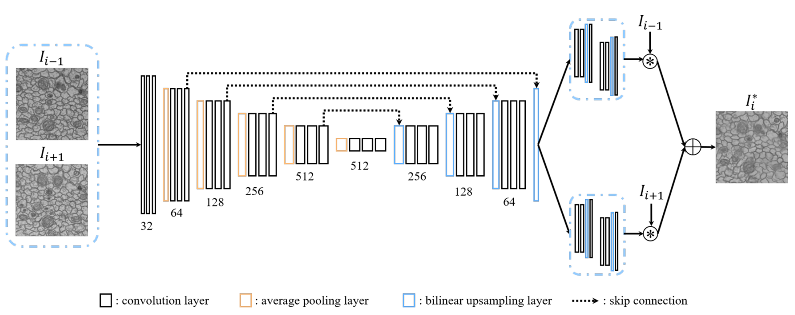
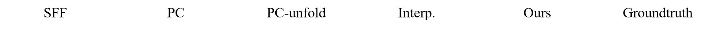
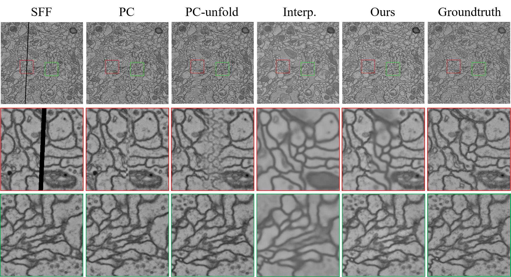
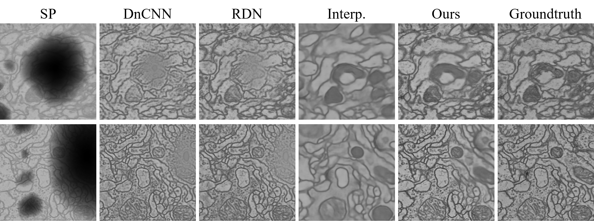
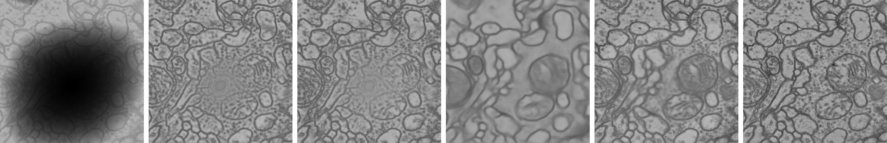

# A Unified Deep Learning Framework for ssTEM Image Restoration


## Dependencies

- Python 3  (Recommend to use [Anaconda](https://www.anaconda.com/download/#linux))

- Pytorch 0.4.0  (later versions may work)

- Numpy
- Scipy
- Cupy

**Installation** 

```bash
cd ./libs/sepconv
bash install.bash
pip install attrdict
pip install tensorboardX
pip install tifffile
pip install joblib
```


If you have a [Docker](https://www.docker.com/) environment, we strongly recommend you to pull our image as follows,

```bash
docker pull shiyuuuu/cuda9.0-cudnn7-devel-ubuntu16.04-torch0.4.0:v1
# If encountering with “Segmentation fault (core dumped)” error, please try with:
docker pull renwu527/auto-emseg:v5.4
```

or

```bash
docker pull registry.cn-hangzhou.aliyuncs.com/shiyu_666/cuda9.0-cudnn7-devel-ubuntu16.04-torch0.4:v1
# If encountering with “Segmentation fault (core dumped)” error, please try with:
docker pull registry.cn-hangzhou.aliyuncs.com/renwu527/auto-emseg:v5.4
```


## Training stage

### SFF

#### 1. Simulation

You can simulate SFF images with `simu_sff/simuSFF.py`, an example is given blow:

```python
cleanpath='001.png'
savepath='./'
SimuSFF(cleanpath,256,savepath,if_shave=True)
```


#### 2. Network training

**Interpolation module:**  

```bash
cd ./sff_scripts_interp
python gen_data_txt.py -f ../data/train_data/
python main_ms.py -c=ms_l1loss_decay
```

**Correction module:** 

```bash
cd ./sff_scripts_unfolding
python main_flowfusionnet.py -c=sff_flowfusionnet_L1_lr0001decay
```

**Fusion module:** 

```bash
cd ./sff_scripts_fusion
python main_fusion.py -c=sff_fusion_L1_lr0001decay
```


### SP

#### 1. Simulation

You can simulate SP images with `simu_sp/simu_sp.py`, an example is given below:

```python
folder='../simu_sp_data/'
im='000.png'
img=io.imread(folder+im)
savefolder=folder

mask_root = '../simu_sp_data/sp_mask_bank/mask/'
mask10_root = '../simu_sp_data/sp_mask_bank/mask10/'
mask01_root = '../simu_sp_data/sp_mask_bank/mask01/'

_degra, _degra_maska, _degra_maskb=SimuSP(img, mask_root, mask10_root, mask01_root)

io.imsave(savefolder+im.strip('.png')+'_degra.png',_degra)
io.imsave(savefolder+im.strip('.png')+'_degra_maska.png',_degra_maska)
io.imsave(savefolder+im.strip('.png')+'_degra_maskb.png',_degra_maskb)
```

You can download our `SP_mask_bank` at [BaiduYun](https://pan.baidu.com/s/15yJ2kthKqgtgBed71EF1XA) (Access code: 1958) or [GoogleDrive](https://drive.google.com/file/d/1Hg9z3LWdFzF6uORY_HvcLADF6VXet38-/view?usp=sharing). 


#### 2. Network training

**Interpolation module:**

```bash
cd ./sp_scripts_train/
python gen_data_txt.py -f ../data/SP_train_data/
python main_interp.py -opt ./config/train_interp.yaml
```

**Correction module:**

```bash
cd ./sp_scripts_train/
python main_correction.py -opt ./config/train_correc.yaml
```

**Fusion module:**

```bash
cd ./sp_scripts_train/
python main_fusion.py -opt ./config/train_fusion.yaml
```


## Testing stage

### SFF

**Interpolation module:**

```bash
cd ./sff_scripts_interp
python inference_singleImage.py -c=ms_l1loss_decay -id=interp -i1=/PATH/IMAGE1.png -i2=/PATH/IMAGE2.png -o=/PATH/OUTPUT.png
```

Or predicting multiply images

```
# For cremia
python inference.py -c=ms_l1loss_decay -id=interp -ip=../SFF_test_data/test_cremia -t=cremia_25sff -op=../results/cremia/
```

Generate interpolation results of training dataset for subsequent correction module and fusion module: 

```bash
python inference_trainingset.py
```


**Correction module:**

```bash
cd ./sff_scripts_unfolding

# Intermediate results for unfolding SFF images.
# Note that it is integrated in the 'inference.py' of fusion module.
# Therefore, you can skip this step if you don't want to obtain the unfolded images.
# For cremia
python inference.py -c=sff_flowfusionnet_L1_lr0001decay -id=unfolding_fusionnet -ip=../SFF_test_data/test_cremia -t=cremia_25sff -op=../results/cremia
```


**Fusion module:**

```bash
cd ./sff_scripts_fusion

# For cremia
python inference.py -c=sff_fusion_L1_lr0001decay -id=fusion -ip=../SFF_test_data/test_cremia -t=cremia_25sff -op=../results/cremia
```


### SP

**Interpolation module:**

```bash
cd ./sp_scripts_test/

# -mp: MODEL PATH
# -dp: TEST DATA PATH
# -im1: THE FIRST IMAGE
# -im2: THE LAST IMAGE
# -sp: SAVE PATH
# -mGPU: IF USE MULTI GPUs?
python test_interp.py -mp ../SP_models/model_vfi.ckpt -dp ../SP_testdata/ -im1 001.png -im2 004.png -sp ../SP_testdata/ -mGPU False
```

Correction module: this part is integrated in the testing code of fusion module.


**Fusion module:**

```bash
cd ./sp_scripts_test/

python test_fusion.py -mp ../SP_models/ -dp ../SP_testdata/ -im1 001.png -im2d 002.png -im2m 002_m.png -im3d 003.png -im3m 003_m.png -im4 004.png -sp ../SP_testdata/
```


## Network configuration

 Our framework consists of three modules, i.e., interpolation, correction, and fusion. The interpolation module is built upon the kernel prediction network (KPN)[1]. The correction module and the fusion module are built upon the U-Net [2].




## Full resolution visual results

### SFF restoration







### SP restoration






## References

[1]. Niklaus, S., Mai, L., Liu, F.: Video frame interpolation via adaptive separable convolution. In: 2017 IEEE International Conference on Computer Vision (ICCV). pp. 261–270 (2017)

[2]. Ronneberger, O., Fischer, P., Brox, T.: U-net: Convolutional networks for biomedical image segmentation. In: Medical Image Computing and Computer-Assisted Intervention – MICCAI 2015. pp. 234–241. Springer International Publishing (2015)


## Acknowledgments

This project is partly built upon [sepconv-slomo](https://github.com/sniklaus/sepconv-slomo) and [sepconv](https://github.com/martkartasev/sepconv)


## Contact

If you have any problem with the released code, please do not hesitate to contact me by email ([sydeng@mail.ustc.edu.cn](mailto:sydeng@mail.ustc.edu.cn)).
